# Hello

I'm **Sandew Hiruditha**, a software developer crafting native applications with **Swift & Xcode** and building on **Cloud Platforms**.

Currently pursuing Computer Science, with a passion for the Apple developer ecosystem, clean system design, and modern cloud infrastructure.

---

### ✦ Focus & Stack

- **Native & Apple Ecosystem:** Swift, SwiftUI, Xcode
- **Cloud & Systems:** AWS, Docker, Linux, Bash
- **Languages & Core:** Python, C++, Git

---

### ✦ Activity

<picture>
  <source media="(prefers-color-scheme: dark)" srcset="./assets/github-snake-dark.svg" />
  <source media="(prefers-color-scheme: light)" srcset="./assets/github-snake.svg" />
  
</picture>

---

[LinkedIn](https://www.linkedin.com/in/sandew-hiruditha-b461b329a) &nbsp;·&nbsp; [GitHub](https://github.com/sadewasadewal)
